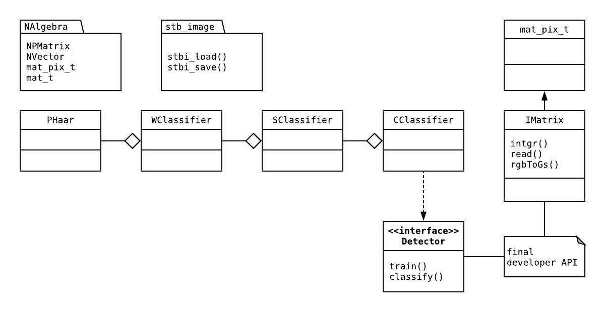

[](https://travis-ci.org/samiBendou/FaceDetection/builds)
[](https://coveralls.io/github/samiBendou/FaceDetection?branch=master)
[](https://www.gnu.org/licenses/gpl-3.0)


# FaceDetection 0.2.1

### Introduction

**Note** The project is currently in progress, not all the features have been implemented neither tested.

**Note** Build and coverage has not been updated and values don't reflect real status of the code. 

FaceDetection is an image processing framework. It is specially design for provide a fast implementation of Viola
and Jones method in C++ which provide real-time object detection machine learning framework.

- **High level** API to easily process and parameter filters

- **Lightweight** enough to be embedded on various microelectronic devices

The framework is based on NAlgebra framework which you can find [here](https://github.com/samiBendou/MathToolKitCPP).
It also uses `stbi_image.h` from stb library to read and write .png and .jpeg files.


### Install

- Clone the project.
 
- Download stb  `stbi_image.h` from [stb library](https://github.com/nothings/stb) and put it on the stb directory at
root of the project.

### Run Unit Tests

- gtest is integrated to the project using cmake. To run unit test just do the install procedure described above and run
`IProcessing` target to run all unit tests.

## Documentation 

### Gettng Started

To use this detector on face you'll have to train it first :

```cpp
std::vector<IMatrix> feature; // training set
std::vector<bool> label;
Detector detector{feature, label}; // initializes and trains the detector
```

Note that you can also initialize a detector without training it and than train it using `detector.train(feature, label)`

Once your detector is train, you can classify a single test image using `detector.classify(test_img)`.


### General concepts

A Detector class allows you to easily train classifiers and use theses to detect faces.
The output of the detector is a boolean which indicates either there is a face on the image or not.

The framework introduces a class called IMatrix which represents an image as a pixel matrix object. This allows to consider
the image as a vector and to provide all classical operations on vectors and also to provide user-friendly representation
for image processing. The IMatrix objects are just mat_pix_t objects but each pixel must have the same type eg. RGB.

The framework is designed so you can easily implement new features, boosting algorithms, CNN... The class structure is
the following :



If you need more details about Viola and Jones method you can at a look at 
the [original publication](http://wearables.cc.gatech.edu/paper_of_week/viola01rapid.pdf)

### Additional information

**Copyright :** &copy; 2019-2018 Sami Dahoux [(GitHub)](https://github.com/samiBendou/), All Rights Reserved

**Last Update :** 21/01/2019

**Version log :**
- 0.2.1 : Minor fixes and optimization
- 0.2.0 : Pseudo Haar features computation added
- 0.1.0 : Basic image processing features such as integral image
